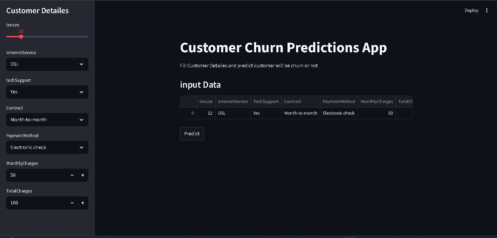
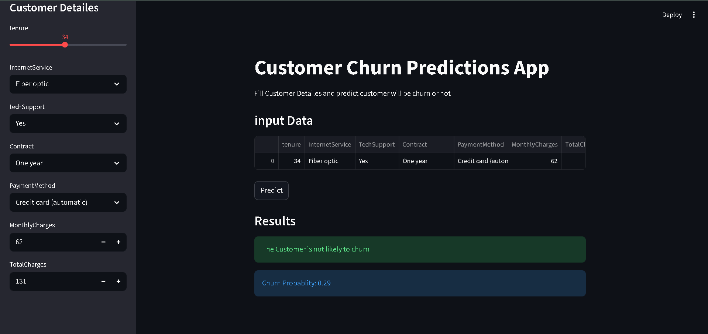

# 📉 Customer Churn Prediction using Machine Learning

## 📌 Project Overview

Customer churn is one of the biggest challenges faced by subscription-based businesses. This project aims to analyze customer behavior, identify the factors influencing churn, and build a machine learning model capable of predicting whether a customer is likely to leave the company.

The project includes complete Exploratory Data Analysis (EDA), data preprocessing, machine learning model development, and a prediction application for real-world usage.

---

## 🎯 Problem Statement

The objective of this project is to predict customer churn using historical customer data and help businesses take proactive actions to retain valuable customers.

---

## 🛠️ Technologies Used

* Python
* Jupyter Notebook
* Pandas
* NumPy
* Matplotlib
* Seaborn
* Scikit-Learn
* Streamlit
* Pickle

---

## 📂 Project Structure

```text
Customer-Churn-Prediction/
│
├── Data/
│   ├── Churn_data.csv
│   └── final_ml_data.csv
│
├── Notebooks/
│   ├── Churn Data Analysis.ipynb
│   └── ml_development.ipynb
│
├── app_screenshots/
│   ├── app_pic.png
│   └── app_prediction.png
│
├── app.py
├── churn_model.pkl
├── requirements.txt
├── README.md
└── .gitignore
```

---

## 🔍 Exploratory Data Analysis (EDA)

The following analyses were performed:

* Dataset exploration and understanding
* Missing value analysis
* Data cleaning and preprocessing
* Univariate analysis
* Bivariate analysis
* Customer behavior analysis
* Churn distribution analysis
* Visualization of important business insights
* Identification of factors affecting customer churn

---

## 🤖 Machine Learning Development

The machine learning pipeline included:

* Feature selection
* Data preprocessing
* Train-test split
* Model training
* Model evaluation
* Performance comparison
* Final model selection
* Saving the trained model using Pickle

---

## 🚀 Prediction Application

A user-friendly prediction application was developed to allow users to enter customer details and predict whether a customer is likely to churn.

### Features

* Interactive user interface
* Real-time predictions
* Easy-to-use input forms
* Business-friendly output

---

## 📷 Application Preview

### Home Screen



### Prediction Example



---

## 💡 Key Outcomes

* Identified important factors influencing customer churn.
* Built an end-to-end churn prediction workflow.
* Developed a deployable prediction application.
* Converted raw customer data into actionable business insights.

---

## ▶️ How to Run the Project

1. Clone the repository.

```bash
git clone <repository_link>
```

2. Install dependencies.

```bash
pip install -r requirements.txt
```

3. Run the application.

```bash
streamlit run app.py
```

---

## 👨‍💻 Author

**Arman Ali**

Aspiring Data Scientist & Machine Learning Enthusiast

Passionate about transforming data into meaningful insights and building practical AI solutions.
